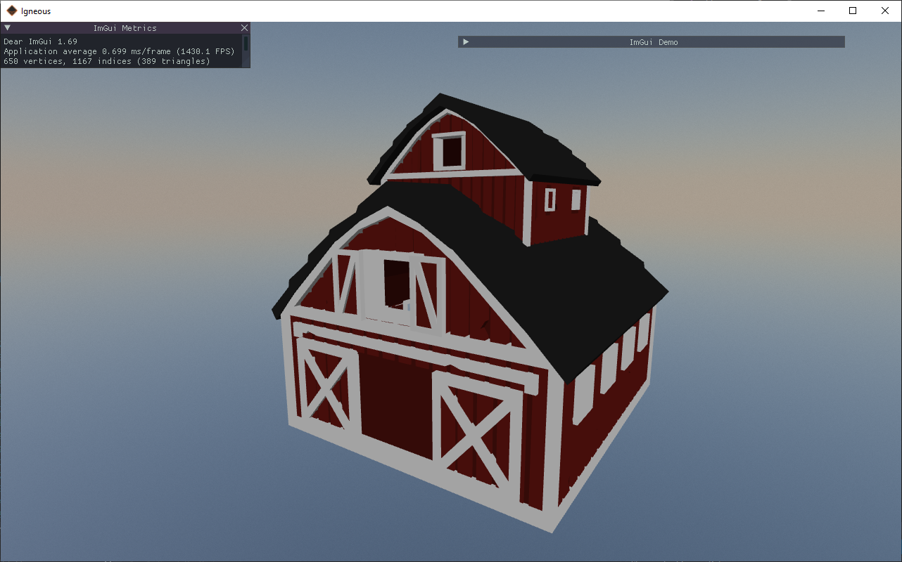

# igneous

[](https://github.com/MissingBitStudios/igneous/releases)
[](https://travis-ci.org/MissingBitStudios/igneous)
[](https://igneous.readthedocs.io/en/latest/?badge=latest)
[](https://discord.gg/CCUwTar)
[](https://www.reddit.com/r/igneous/)
[](https://trello.com/b/05omR9Mj/igneous)

Igneous is an open source game engine written in C++.



## Getting Started

These instructions will get you a copy of the project up and running on your local machine for development and testing purposes.

### Prerequisites

* CMake
* OpenAL Redistributable
* OpenAL SDK

### Environment Variables

The install directory for the OpenAL SDK should be added as an environment variable named `OPENALDIR` in your system. This is not necessary, but is a safeguard in case CMake cannot find the install directory in one of the default search paths.

### Checkout

```sh
git clone https://github.com/MissingBitStudios/igneous.git
cd igneous
git submodule update --init --recursive
```

### Build

```sh
mkdir build
cd build
cmake ..
cmake --build .
```

### Update

```sh
git pull
git submodule sync
git submodule update --init --recursive
```

## Documentation

The API reference and tutorials are available on https://igneous.readthedocs.io

## Built With

* [Assimp](https://github.com/assimp/assimp) - [Website](http://assimp.sourceforge.net/)
* [bgfx](https://github.com/bkaradzic/bgfx)
* [Bullet Physics](https://github.com/bulletphysics/bullet3) - [Website](http://bulletphysics.org/)
* [EnTT](https://github.com/skypjack/entt)
* [GLFW](https://github.com/glfw/glfw) - [Website](http://www.glfw.org/)
* [GLM](https://github.com/g-truc/glm) - [Website](https://glm.g-truc.net/)
* [Dear ImGui](https://github.com/ocornut/imgui)
* [OpenAL](https://www.openal.org/)
* [RakNet](https://github.com/facebookarchive/RakNet) - [Website](http://www.raknet.net/)
* [spdlog](https://github.com/gabime/spdlog)
* [stb](https://github.com/nothings/stb)

## Contributing

Please read [CONTRIBUTING.md](CONTRIBUTING.md) for details on our code of conduct, and the process for submitting pull requests to us.

## Changelog

All notable changes to this project will be documented in [CHANGELOG.md](CHANGELOG.md). The changelog format is based on [Keep a Changelog](http://keepachangelog.com/en/1.0.0/) and adheres to [Semantic Versioning](http://semver.org/spec/v2.0.0.html).

## Versioning

We use [SemVer](http://semver.org/spec/v2.0.0.html) for versioning. For the versions available, see the [releases page](https://github.com/MissingBitStudios/igneous/releases). 

## Authors

* [widberg](https://github.com/widberg)
* [pcguy123](https://github.com/pcguy123)

See also the list of [contributors](https://github.com/MissingBitStudios/igneous/graphs/contributors) who participated in this project.

## License

This project is licensed under the Creative Commons Attribution 4.0 International Public License (CC-BY-4.0) - see the [LICENSE.md](LICENSE.md) file for details.

## Acknowledgements

* Thank you to the authors of the dependencies used.
* Thank you to the amazing teachers on YouTube: [ThinMatrix](https://www.youtube.com/user/ThinMatrix), [TheChernoProject](https://www.youtube.com/user/TheChernoProject), [thebennybox](https://www.youtube.com/user/thebennybox), [Code Rad](https://www.youtube.com/user/YouKondziu), and [Derek Banas](https://www.youtube.com/user/derekbanas).
